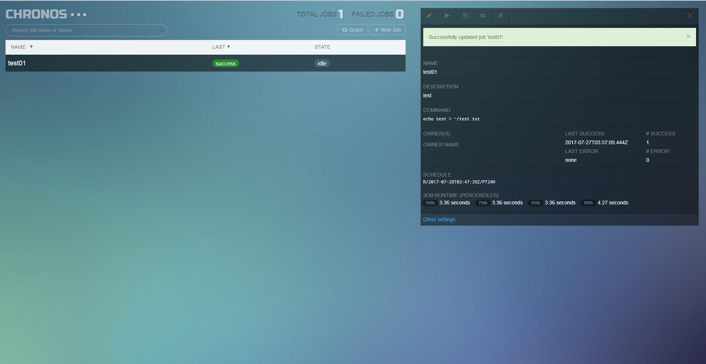
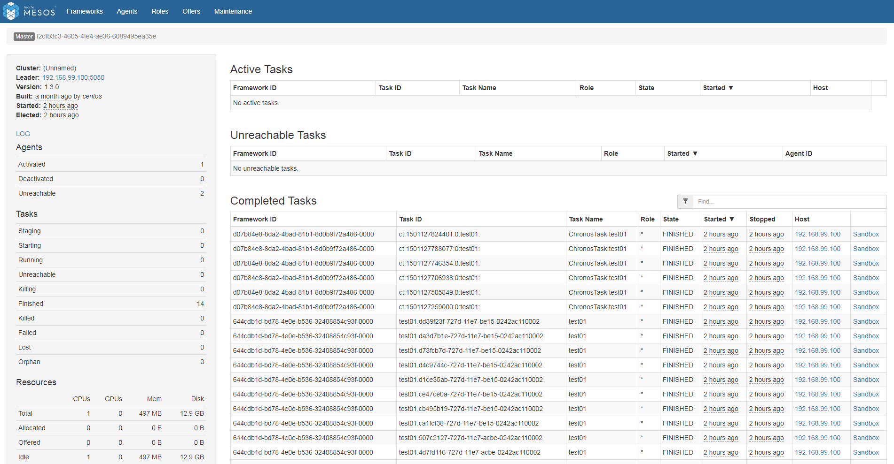
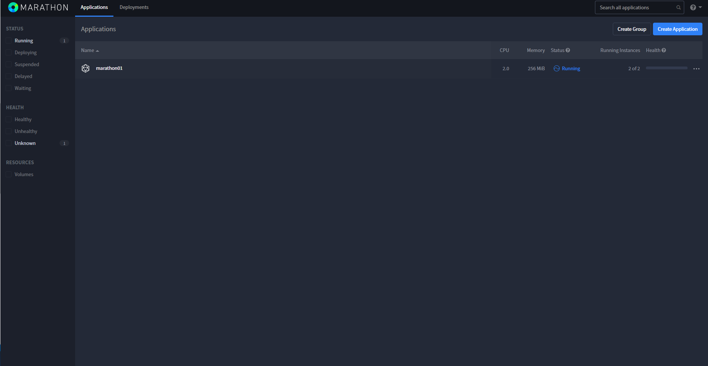
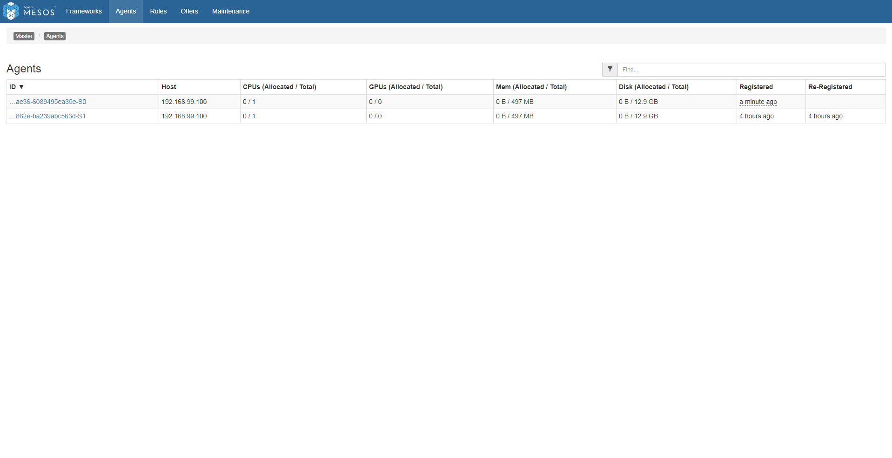

# Apache Mesos入門
動作確認までできたのでメモ

公式サイトはよくわからない  
結局、以下は全部あったほうがいい

* chronos（単一ジョブ登録）
* mesos（クラスタ管理）
* marathon（複数サーバまたがるジョブ登録。Webサーバなど）
* zookeeper（名前解決）

## 環境  
* Windows 7
  * CentOS 7.2 on Docker


## CentOS立ち上げ  
```
$ docker-machine ip
192.168.99.100
$ docker run -itd -p 4400:4400 -p 8080:8080 -p 5050:5050 --privileged --name demo-mesos centos:7 /sbin/init
$ docker exec -it demo-mesos bash 
```

以降、CentOS作業
## インストール

```
$ rpm -Uvh http://repos.mesosphere.com/el/7/noarch/RPMS/mesosphere-el-repo-7-2.noarch.rpm 
$ yum -y install mesos mesosphere-zookeeper marathon chronos 
$ systemctl start zookeeper 
$ systemctl start chronos
$ systemctl start mesos-master 
$ systemctl start mesos-slave 
$ systemctl start marathon 
```


## セットアップ
hostnameを指定しないと接続に失敗したので起動オプションで稼動してるサーバのIPを追加  
⇒他にイケてるやり方あるはず

```
$ systemctl stop mesos-master
$ systemctl stop mesos-slave
$ /usr/sbin/mesos-master --zk=zk://localhost:2181/mesos --port=5050 --log_dir=/var/log/mesos --quorum=1 --work_dir=/var/lib/mesos --hostname=192.168.99.100
$ /usr/sbin/mesos-slave --master=zk://localhost:2181/mesos --log_dir=/var/log/mesos --work_dir=/var/lib/mesos  --hostname=192.168.99.100

```

## UI確認

|service|url|説明|image|
|---|---|---|---|
|chronos|[http://192.168.99.100:4400](http://192.168.99.100:4400)|ジョブを定義してRUNさせるとmesosが実行してくれる| |
|mesos|[http://192.168.99.100:5050](http://192.168.99.100:5050)| chronos、marathonでジョブ実行すると色々表示される| |
|marathon|[http://192.168.99.100:8080](http://192.168.99.100:8080)|chronosとの違いはスケールしてジョブを実行できるところ| |


# 番外

## Slave追加

Slave用サーバ立ち上げ
```
$ docker run -itd --privileged --name mesos-slave01 centos:7 /sbin/init
```

mesosインストール
```
$ rpm -Uvh http://repos.mesosphere.com/el/7/noarch/RPMS/mesosphere-el-repo-7-2.noarch.rpm 
$ yum -y install mesos
```

セットアップ  
zookeeperはmaster環境に存在するため宛先を修正
```
$ systemctl stop mesos-master
$ systemctl stop mesos-slave
$ /usr/sbin/mesos-slave --master=zk://192.168.99.100:2181/mesos --log_dir=/var/log/mesos --work_dir=/var/lib/mesos  --hostname=192.168.99.100
```

mesos uiのAgentsから確認。2台目が追加されている  
